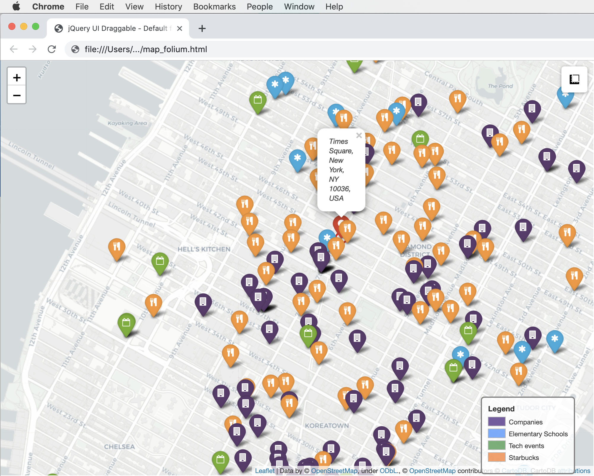
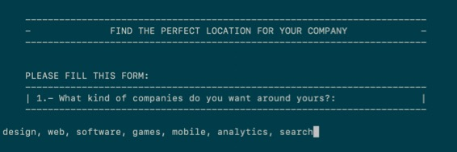
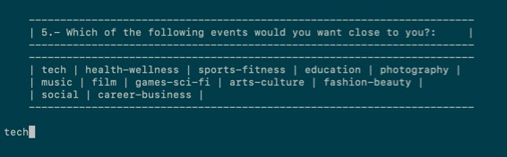
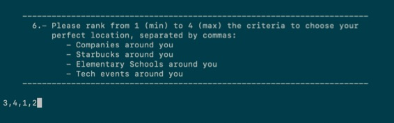
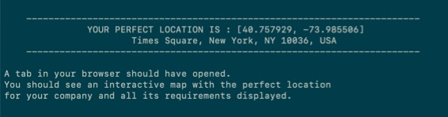

# Company Location Finder
Ironhack Madrid Data Bootcamp project nº3

## Overview

The goal of this project was to define the perfect location for a fictitious company based on some given criteria by using MongoDB and APIs to enrich the data, and display the result in a map.

My approach to the problem was to create a program that not only works for the given example, but for any company location search.

I start from a data set from [Crunchbase](https://www.crunchbase.com) which contains data about more than 18K companies.

I use MongoDB to store the data and to perform GeoJSON queries based on the arguments passed by the user, as well as the following APIs to enrich the data:
- [Foreign exchange rates API](https://exchangeratesapi.io/)
- [Google Places API](https://developers.google.com/places/web-service/intro)
- [Google Geocoding API](https://developers.google.com/maps/documentation/geocoding/start)
- [Meetup API](https://www.meetup.com/meetup_api/)

Finally I display the final selected location along with all the relevant nearby locations in an HTML using Folium.
 

---

## Project phases

### 1 - Data cleaning

Phase where I import the data to MongoDB Compass and clean it using Pandas to prepare it for being processed.

1. First step is to import the data from the Crunchbase JSON file to MongoDB Compass
2. Acquire data from MongoDB using FIND queries to perform a first filter on the raw data
3. Clean the dataset using Pandas (stack various offices in different rows, add geopoint and convert total raised currency using the [Foreign exchange rates API](https://exchangeratesapi.io/))
4. Import the cleaned data back to MongoDB Compass as a new collection

### 2 - Data processing

Phase where I process the data based on the arguments passed by the user in a questionnaire.

1. Display the questionnaire to the user and receive argument information
2. Import the cleaned data from MongoDB compass filtering by the categories the user introduces, which are found through RegEx categorization
3. Populate a dataset of coordinates (got from the initial JSON file) with:
    * The number of companies of the wanted categories that the coordinate has around (using geoNear function)
    * The number of selected restaurants/cafes close to the coordinate (using [Google Places API](https://developers.google.com/places/web-service/intro))
    * The number of selected services close to the coordinate (using [Google Places API](https://developers.google.com/places/web-service/intro))
    * The number of events of the selected category happening close to the company (using [Meetup API](https://www.meetup.com/meetup_api/))

### 3 - Data filtering and visualization

Final phase, where I filter the dataset based on the level of importance given to each of the arguments by the user, find the perfect location and plot it.

1. Normalize the data in each of the columns of the dataframe and assign them their level of importance to calculate the final coordinate ranking and find the best location for the company
2. Get the address of the selected coordinates (using the [Google Geocoding API](https://developers.google.com/maps/documentation/geocoding/start))
3. Plot with Folium the final location and all its nearby selected companies, restaurants, services and events (create legend with HTML)
4. Display the result on screen and automatically open an HTML file in the browser with the Folium interactive map

## Annex

### Questionnaire:

 

